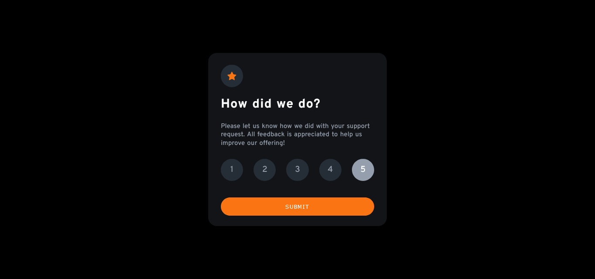
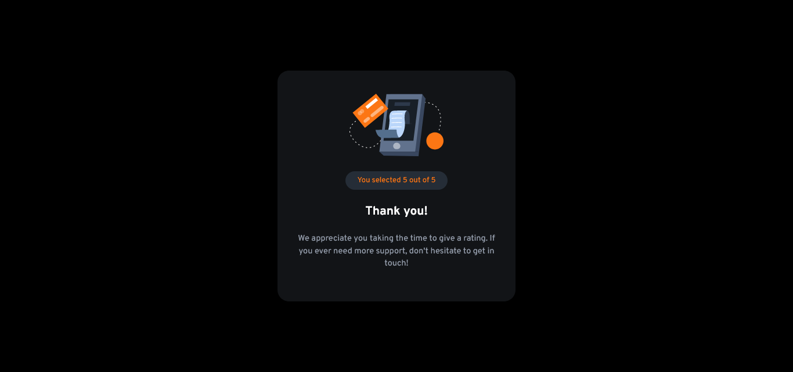
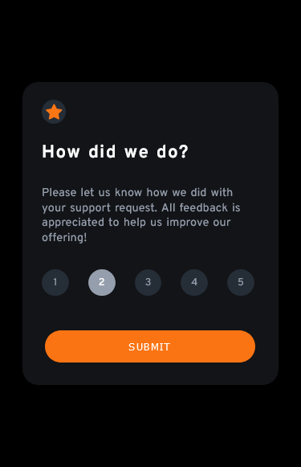
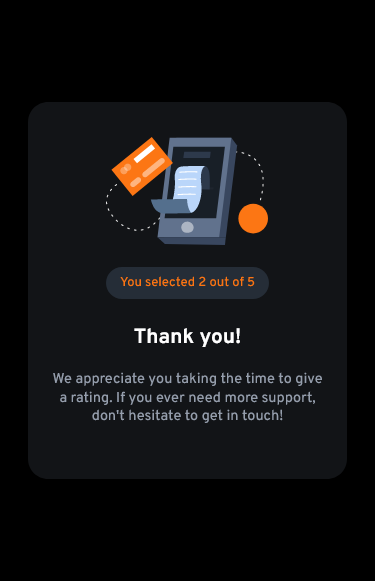

# Frontend Mentor - Interactive rating component solution

This is a solution to the [Interactive rating component challenge on Frontend Mentor](https://www.frontendmentor.io/challenges/interactive-rating-component-koxpeBUmI). Frontend Mentor challenges help you improve your coding skills by building realistic projects.

## Table of contents

- [Overview](#overview)
  - [The challenge](#the-challenge)
  - [Screenshot](#screenshot)
  - [Links](#links)
- [My process](#my-process)
  - [Built with](#built-with)
  - [What I learned](#what-i-learned)
  - [Continued development](#continued-development)
  - [Useful resources](#useful-resources)
- [Author](#author)
- [Acknowledgments](#acknowledgments)

## Overview

### The challenge

Users should be able to:

- View the optimal layout for the app depending on their device's screen size
- See hover states for all interactive elements on the page
- Select and submit a number rating
- See the "Thank you" card state after submitting a rating

### Screenshot







Holding ctrl, click on the above link to access the images from the challange.

### Links

- Solution URL: (https://github.com/Odo-Peter/frontend-mentor-interactive-rating-review)
- Live Site URL: (https://frontend-mentor-interactive-rating-review-lsun67pp8-odo-peter.vercel.app)

## My process

### Built with

- Semantic HTML5 markup
- CSS custom properties
- Flexbox
- Vanilla JavaScript

### What I learned

Doing this challenge has taught me the importance of a proper markup and the power of CSS, alongside media queries, also, in the cause of the challenge, learning to work with an API again, feels awesome (by API, I meant importing the google fonts from google api and using it in the challenge).

The challenge has also added to my knowledge, in terms of using markdown files and in committing a file to github, basically working with the command line has improved some more, all thanks to this challenge.

Some code snippets I'm sure proud of, see below:

```css
:root {
  --primary-color: hsl(25, 97%, 53%);
  --white: hsl(0, 0%, 100%);
  --paragraph-color: hsl(217, 12%, 63%);
  --review-background: hsl(216, 12%, 54%);
  --svg-background: hsl(213, 19%, 18%);
  --container-background: hsl(216, 12%, 8%);
}
```

```js
reviews.forEach((review) => {
  review.addEventListener('click', reviewState);
});
};
```

### Continued development

In future projects or challenges, I'ld love to write a function that removes the class of 'active' on a given 'span' when another 'span' is being clicked i.e, in handling event listeners in javascript, all clicked 'span', shouldn't have the class 'active' at the same time.

### Useful resources

- [Free code camp](https://www.freecodecamp.org) - This site personally has improved my coding skills from 0 to a reasonable figure, lol, I'll recommend any person new to programming and coding to check free code camp for FREE. Ensure to be kind enough to give a little donation to help them to continue giving out value.
- [Tech Twitter](https://www.twitter.com) - Tech twitter has helped with several links to quality resources, articles, podcasts, videos, etc, that has helped to improve my coding skills and thus helping me complete this challenge.

## Author

- Frontend Mentor - [@Odo-Peter](https://www.https://frontendmentor.io/profile/Odo-Peter)
- Twitter - [@Odo_kode](https://www.twitter.com/Odo_kode)

## Acknowledgments

I really want to acknowledge myself for a work 'not really well done' LOL 🎉
